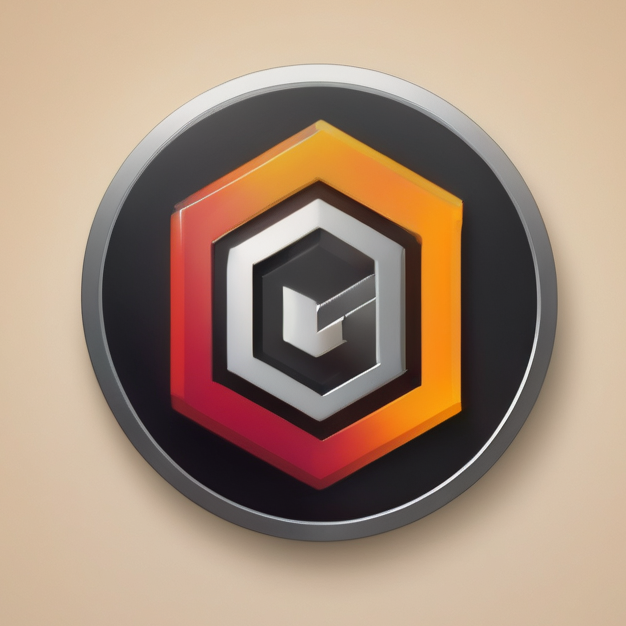

<a name="readme-top"></a>

<!-- PROJECT SHIELDS -->

[![Contributors][contributors-shield]][contributors-url]
[![Forks][forks-shield]][forks-url]
[![Stargazers][stars-shield]][stars-url]
[![Issues][issues-shield]][issues-url]
[![MIT License][license-shield]][license-url]
[![LinkedIn][linkedin-shield]][linkedin-url]

<!-- PROJECT LOGO -->
<br />
<div align="center">
  <a href="https://github.com/sifterstudios/bitbucket-notifier">
    
  </a>

<h3 align="center">Bitbucket Notifier</h3>

  <p align="center">
    Get toast-notifications natively through your linux install for relevant activity on the Pull Requests relevant for you from your Bitbucket server. Customize *what* to show and **when** it should show. 
    <br />
    <a href="https://github.com/sifterstudios/bitbucket-notifier"><strong>Explore the docs »</strong></a>
    <br />
    <br />
    <a href="https://github.com/sifterstudios/bitbucket-notifier">View Demo</a>
    ·
    <a href="https://github.com/sifterstudios/bitbucket-notifier/issues">Report Bug</a>
    ·
    <a href="https://github.com/sifterstudios/bitbucket-notifier/issues">Request Feature</a>
  </p>
</div>

<!-- TABLE OF CONTENTS -->
<details>
  <summary>Table of Contents</summary>
  <ol>
    <li>
      <a href="#about-the-project">About The Project</a>
      <ul>
        <li><a href="#built-with">Built With</a></li>
      </ul>
    </li>
    <li>
      <a href="#getting-started">Getting Started</a>
      <ul>
        <li><a href="#prerequisites">Prerequisites</a></li>
        <li><a href="#installation">Installation</a></li>
      </ul>
    </li>
    <li><a href="#usage">Usage</a></li>
    <li><a href="#roadmap">Roadmap</a></li>
    <li><a href="#contributing">Contributing</a></li>
    <li><a href="#license">License</a></li>
    <li><a href="#contact">Contact</a></li>
    <li><a href="#acknowledgments">Acknowledgments</a></li>
  </ol>
</details>

<!-- ABOUT THE PROJECT -->

## About The Project

[![Product Name Screen Shot][product-screenshot]](https://github.com/sifterstudios/bitbucket-notifier)

<p align="right">(<a href="#readme-top">back to top</a>)</p>

### Built With

- [Golang](https://go.dev/)
- [Notify-send](https://developer.gnome.org/notification-spec/)
- [Bitbucket API](https://docs.atlassian.com/bitbucket-server/rest/7.8.0/bitbucket-rest.html#idp62)
- [Resty](https://github.com/go-resty/resty/v2)
- [Crypto](https://golang.org/pkg/crypto/)
- [Term](https://golang.org/pkg/term/)
- [Net](https://golang.org/pkg/net/)
- [Sys](https://golang.org/pkg/sys/)
- [Yaml v2](https://gopkg.in/yaml.v2)

<p align="right">(<a href="#readme-top">back to top</a>)</p>

<!-- GETTING STARTED -->

## Getting Started

### Prerequisites

This is an example of how to list things you need to use the software and how to install them.

- Package Manager
  ```sh
  sudo apt install notify-send
  ```

### Installation

1. Clone the repo :)
   ```sh
   git clone https://github.com/sifterstudios/bitbucket-notifier
   ```

<p align="right">(<a href="#readme-top">back to top</a>)</p>

<!-- USAGE EXAMPLES -->

## Usage

Download repo, build, and run. Needs to be run from `/cmd` directory currently.

On first run, you will be prompted to input your options and credentials. This will be saved to a config file(encrypted).
Please note, this is only a semi-secure solution as the key for the decryption is also made and available inside the `/data` folder.

Although both the secretkey and the config file is ignored in the `.gitignore` file, and therefore won't automatically be pushed, it's important to be aware of this as a potential security risk.

I only made the credentials encrypted to not accidentally show that info when browsing the files.

After adding credentials and info, the frontend should be available at [http://localhost:1337](http://localhost:1337) and enables you to choose more customization of _how_ and **when** you want to be notified, as well as how often to check.

And that's pretty much it!

Information about how to run this automatically on startup will follow in the future.

<p align="right">(<a href="#readme-top">back to top</a>)</p>

<!-- ROADMAP -->

## Roadmap

See the [open issues](https://github.com/sifterstudios/bitbucket-notifier/issues) for a list of proposed features (and known issues).

<p align="right">(<a href="#readme-top">back to top</a>)</p>

<!-- CONTRIBUTING -->

## Contributing

Contributions are what make the open source community such an amazing place to learn, inspire, and create. Any contributions you make are **greatly appreciated**.

If you have a suggestion that would make this better, please fork the repo and create a pull request. You can also simply open an issue with the tag "enhancement".
Don't forget to give the project a star! Thanks again!

1. Fork the Project
2. Create your Feature Branch (`git checkout -b feature/AmazingFeature`)
3. Commit your Changes (`git commit -m 'Add some AmazingFeature'`)
4. Push to the Branch (`git push origin feature/AmazingFeature`)
5. Open a Pull Request

<p align="right">(<a href="#readme-top">back to top</a>)</p>

<!-- LICENSE -->

## License

Distributed under the MIT License. See `LICENSE.txt` for more information.

<p align="right">(<a href="#readme-top">back to top</a>)</p>

<!-- CONTACT -->

## Contact

Your Name - [@sifterstudios](https://twitter.com/sifterstudios)

Project Link: [https://github.com/sifterstudios/bitbucket-notifier](https://github.com/sifterstudios/bitbucket-notifier)

<p align="right">(<a href="#readme-top">back to top</a>)</p>

<!-- MARKDOWN LINKS & IMAGES -->

[contributors-shield]: https://img.shields.io/github/contributors/sifterstudios/bitbucket-notifier.svg?style=for-the-badge
[contributors-url]: https://github.com/sifterstudios/bitbucket-notifier/graphs/contributors
[forks-shield]: https://img.shields.io/github/forks/sifterstudios/bitbucket-notifier.svg?style=for-the-badge
[forks-url]: https://github.com/sifterstudios/bitbucket-notifier/network/members
[stars-shield]: https://img.shields.io/github/stars/sifterstudios/bitbucket-notifier.svg?style=for-the-badge
[stars-url]: https://github.com/sifterstudios/bitbucket-notifier/stargazers
[issues-shield]: https://img.shields.io/github/issues/sifterstudios/bitbucket-notifier.svg?style=for-the-badge
[issues-url]: https://github.com/sifterstudios/bitbucket-notifier/issues
[license-shield]: https://img.shields.io/github/license/sifterstudios/bitbucket-notifier.svg?style=for-the-badge
[license-url]: https://github.com/sifterstudios/bitbucket-notifier/blob/master/LICENSE.txt
[linkedin-shield]: https://img.shields.io/badge/-LinkedIn-black.svg?style=for-the-badge&logo=linkedin&colorB=555
[linkedin-url]: https://linkedin.com/in/linkedin_username
[product-screenshot]: images/screenshot.png

```

```
